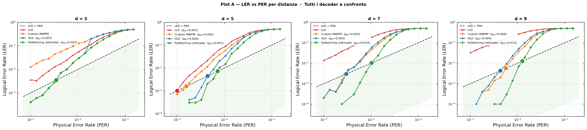
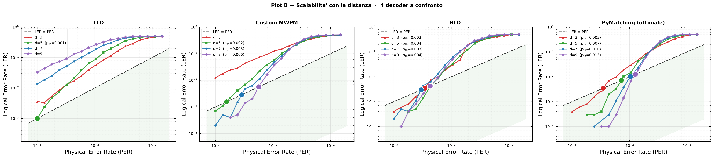
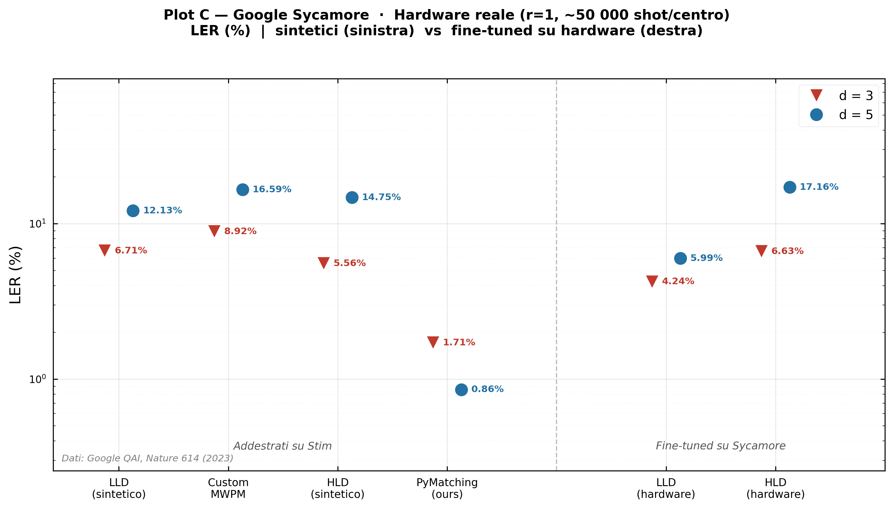

# High Performance and Quantum Computing, QEC Decoder Benchmarking

Final project for the High Performance and Quantum Computing course (MSc in Computer Engineering, University of Naples Federico II, prof. Cilardo).

Author: Luigi Caucci (@lcaucci27).

## What this project is about

The goal is to reproduce and benchmark neural-network decoders for quantum error correction (QEC) on the rotated surface code, following Overwater, Babaie & Sebastiano, *Neural-Network Decoders for Quantum Error Correction Using Surface Codes: A Space Exploration of the Hardware Cost-Performance Tradeoff* (arXiv:2202.05741).

We implement and compare four decoders:

- **LLD** (Low-Level Decoder): a feedforward NN that maps the raw ancilla syndrome directly to the predicted logical flip, with no QEC-specific structure at all.
- **Custom MWPM**: PyMatching run with a fixed, intentionally wrong assumed error rate (`P_ASSUMED = 0.30`). This makes it deterministic and systematically biased, which is exactly what HLD needs to learn to correct.
- **HLD** (High-Level Decoder): Custom MWPM acting as a Pure Error Decoder (PED), plus a small NN that learns only the residual correction (`PM_optimal XOR PED`), which is a much easier target than predicting the flip from scratch.
- **PyMatching**: standard MWPM with the true physical error rate, used as the theoretical upper bound.

Decoders are evaluated on synthetic data generated with Stim (circuit-level depolarizing noise) and on real hardware data from the Google Sycamore `qec3v5` experiment (Zenodo dataset, Google Quantum AI, *Nature* 614, 2023), including a fine-tuning step where LLD/HLD are adapted to hardware noise starting from the synthetic-trained weights.

Expected hierarchy at `p` close to the pseudo-threshold `p_th`:

```
LLD  >=  Custom MWPM  >=  HLD  >=  PyMatching
(worst)                              (best)
```

PyMatching knows the real `p`; HLD uses the PED's deterministic residual; LLD has no code structure to exploit at all.

## What worked and what didn't

The `LLD > MWPM > HLD ~= PyMatching` hierarchy holds cleanly at d=3 and d=5. It breaks down at d=7/9: HLD does not beat Custom MWPM there. The likely cause is training signal: near `p_th`, PyMatching and Custom MWPM disagree on only 4 to 8% of syndromes, and at d=7/9 the syndrome space is much bigger (48/80 ancillas vs 8/24), so the NN struggles to generalize from a comparably sized dataset even with `pos_weight_cap=40`. The paper reaches convergence with much larger datasets and hardware-in-the-loop training; this consumer CPU/GPU setup does not fully get there.

On real Sycamore hardware, PyMatching with a per-center calibrated DEM gets close to Google's published numbers (1.7% LER at d=3, 0.9% at d=5). All NN decoders show a domain-shift gap between synthetic and hardware LER (trained on isotropic depolarizing noise, evaluated on coherent, spatially non-uniform hardware noise), and this gap grows with `d`. Fine-tuning on the hardware split closes most of that gap for LLD, but not for HLD: HLD's PED is a fixed, non-trainable component built around `P_ASSUMED=0.30`, and on hardware noise that assumption is simply wrong, so the NN ends up trying to "correct" an already-wrong baseline and sometimes makes things worse (HLD_hw at d=5 goes from 14% to 17.2%).

Full numeric results, plots, and a detailed discussion of every deviation from the paper are in [README section below](#results) and in `results/final/`.

## Tech stack

- Python 3.10
- PyTorch, for the LLD/HLD neural networks (2 hidden layers, SQNL activation)
- Stim, to simulate the rotated surface code under circuit-level depolarizing noise
- PyMatching, for MWPM decoding (both the calibrated and the deliberately-biased variant)
- NumPy / SciPy, for data handling and pseudo-threshold interpolation (`brentq`/`interp1d`)
- Matplotlib, for the final plots

## Repository structure

```
Progetto/
├── decoders/
│   ├── base_decoder.py      abstract interface (predict / train)
│   ├── activations.py       SQNL activation (paper Sec. III.B)
│   ├── custom_mwpm.py       PED: PyMatching with fixed P_ASSUMED=0.30
│   ├── lld_decoder.py       LLD: syndrome -> logical flip, no structure
│   └── hld_decoder.py       HLD: PED + NN residual correction
├── data/
│   ├── synthetic_dataset.py Stim-based synthetic dataset (circuit-level noise)
│   └── google_sycamore.py   loader for the Google Sycamore Zenodo dataset
├── evaluation/
│   ├── metrics.py           LER, LER/round, pseudo-threshold and decoder-threshold search
│   └── benchmark.py         training + evaluation orchestration, JSON result cache
├── plotting/
│   ├── plot_utils.py        shared log-log axes, y=x diagonal, pseudo-threshold markers
│   └── plots_final.py       the 3 final plots: A (LER vs PER), B (scaling), C (Sycamore)
├── results/
│   ├── final/cpu/, final/gpu/   generated plots + benchmark_results.json cache
│   └── checkpoints/cpu/, gpu/   trained NN weights (lld_d{d}.pt, hld_d{d}.pt)
├── config.py                 global constants: distances, p-sweep, paths, training hyperparameters
├── main.py                   entry point
└── requirements.txt
```

## Installation

```bash
pip install -r requirements.txt
```

Main dependencies: `numpy`, `matplotlib`, `stim`, `pymatching`, `pyyaml`, `torch`, `scipy`.

## Configuration

Set the path to the Google Sycamore dataset in `config.py`:

```python
GOOGLE_DATASET_PATH = r"C:\path\to\google_qec3v5_experiment_data"
```

If the path doesn't exist, Plot C is skipped automatically and only the synthetic benchmark runs.

## Running it

```bash
# full training on CPU (~20-35 min, 256+64 network)
python main.py

# full training on GPU (~60-90 min, 512+256 network, heavier training)
python main.py --gpu

# regenerate the plots from existing checkpoints, no retraining (CPU)
python main.py --skip-benchmark

# same, GPU checkpoints
python main.py --skip-benchmark --gpu

# skip the Sycamore hardware evaluation (Plot A/B only)
python main.py --skip-sycamore

# custom set of distances
python main.py --distances 3 5 7
```

Checkpoints are saved under `results/checkpoints/{cpu,gpu}/`. At the end, `results/final/{mode}/benchmark_results.json` is written as a cache: subsequent `--skip-benchmark` runs reuse it directly and only redo the hardware fine-tuning step for Plot C.

## Results

Synthetic data (Plot A, LER vs PER, and Plot B, scaling with distance):




Google Sycamore hardware evaluation (Plot C, LER at r=1, synthetic vs hardware fine-tuned decoders):



GPU-config runs (`h1=512, h2=256`) are in `results/final/gpu/`.

## Design choices and fidelity to the paper

Followed closely: 3-layer NN (`d^2-1 -> h1 -> h2 -> 1`) with SQNL activation, identical architecture for LLD and HLD, `h1=256, h2=64` for the CPU config (paper Table III), HLD input restricted to the syndrome only (not the PED's flip), HLD target defined as `PM_pred XOR PED_pred` so it stays deterministic and label-noise-free.

Deviations, and why:

- **Adam + CosineAnnealingLR** instead of an unspecified optimizer: converges faster within the limited training budget I could afford.
- **HLD trained on 3 p-values per distance** instead of one: `p_th` shifts with `d`, and training on a single p caused overfitting to one syndrome density.
- **`pos_weight_cap=40`**: with only 4-8% positive residuals near `p_th`, an unweighted BCE loss collapses to always predicting the negative class.
- **Safety valve** (fallback to PED if NN fire rate > 30%): not in the paper, added after I saw the NN overfire at very low p where the syndrome is nearly all zeros.
- **GPU config with `h1=512, h2=256`**: not in the paper, tried to give the network more capacity to catch circuit-level noise correlations that MWPM ignores.
- **80/20 hardware fine-tuning split, 40/60 epochs**: not in the paper, added specifically to measure how much domain adaptation actually buys you.
- **Per-center DEM for PyMatching on hardware** instead of one averaged DEM: cuts LER by roughly 4x, the paper doesn't specify which DEM Google used.

## Google Sycamore dataset

Dataset: Google Quantum AI, *Nature* 614, 676-681 (2023), distributed on Zenodo as `google_qec3v5_experiment_data`.

The loader expects directories named `surface_code_b{basis}_d{distance}_r{rounds}_center_{row}_{col}/`, each containing `obs_flips_actual.01`, `obs_flips_predicted_by_pymatching.01`, `obs_flips_predicted_by_correlated_matching.01`, `obs_flips_predicted_by_belief_matching.01`, `circuit_noisy.stim` (for the calibrated PER), `detection_events.b8` (bit-packed hardware detection events) and `circuit_detector_error_model.dem` (per-center calibrated DEM). `repetition_code_*` directories are ignored, and duplicate experiment directories (which can show up when the dataset lives on OneDrive) are deduplicated by name.
