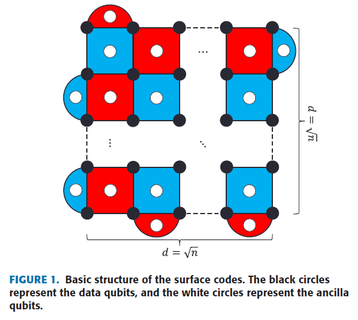
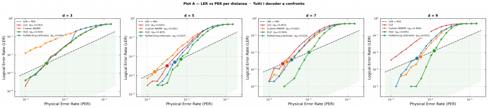

# Neural Network Decoders for Surface Codes

Building universal, fault-tolerant quantum computers runs into an unavoidable physical problem even at the current stage of technology: physical qubits are inherently fragile, subject to decoherence and error processes that degrade the encoded information even when nothing is actively being done to the quantum register. The theoretical answer to this is quantum error correction (QEC), which protects a logical qubit by spreading its information across many physical qubits, so that local errors can be identified and corrected without destroying the quantum superposition. Among the QEC code families proposed over the last few decades, surface codes, and specifically the rotated surface code variant, hold a prominent place today. Their two-dimensional topological structure, their compatibility with physical architectures that only need local connectivity, and the relative simplicity of their measurement circuits make them the most serious candidates for implementation on superconducting hardware in the medium and long term.

Decoding, meaning figuring out which correction operator to apply given the measured syndromes, is computationally demanding though. The classical reference algorithm, Minimum Weight Perfect Matching (MWPM), gives polynomial-time guarantees and reasonable performance, but it stays suboptimal when the noise channel is correlated or asymmetric. In recent years neural-network-based approaches have opened up an alternative direction. Neural decoders don't need an explicit error model built by hand, and they can adapt through training to arbitrary, potentially non-stationary noise distributions.

## Surface code basics

### Stabilizer codes

To protect a logical qubit from errors, its information gets spread across several physical qubits. The code is defined by a set of local parity measurements called stabilizers: operators that always return +1 when applied to the correct state. If something goes wrong, some stabilizer returns -1 instead.

The outcome of all these measurements forms the syndrome, a binary vector of d² - 1 bits that is the input to every decoder.

The key idea for understanding decoding is that every error splits into a deterministic part, the pure error, which you can read directly off the syndrome, and a logical part L, which represents the actual damage to the logical qubit. That second part is the only thing the decoder actually needs to predict, which reduces decoding to a classification problem: given the syndrome, classify L.

### The rotated surface code layout

The rotated surface code of distance d places the data qubits on the vertices of a square grid rotated 45 degrees. Ancilla qubits sit on the faces and measure X or Z stabilizers on their neighboring qubits, depending on which face they're on.

The fundamental property is the distance d: an error touching fewer than d/2 qubits can never produce a logical flip. Increasing d increases protection, but it costs more physical qubits, d² data qubits and d²-1 ancillas.

There's a less obvious property of the lattice worth mentioning: QEC degeneracy. Identical syndromes can correspond to different physical errors that nonetheless require the same logical correction.



### Syndromes and the noise model

Syndromes are extracted indirectly: each ancilla interacts with its neighboring qubits through CNOT gates and then gets measured. The result is 0 if everything's fine, 1 if there's an error somewhere in that ancilla's support.

The noise model used here is circuit-level depolarizing noise. Noise doesn't just hit the data qubits, it hits every single operation in the circuit, every gate, every measurement, every reset. This produces syndromes that are correlated in both time and space, making the problem noticeably harder than the simple model where each qubit fails independently. The choice is motivated by wanting direct comparability with real hardware like Google's Sycamore.

### Pseudo-threshold

The main metric shown on the plots is the pseudo-threshold: the physical error rate p at which the decoder's logical error rate equals the physical error rate itself, in other words the point where correcting is equivalent to doing nothing at all.

On the plot this is where the decoder's curve crosses the y=x diagonal in log-log scale. Above that point the code makes things worse. Below it, QEC is genuinely helping. It's shown as a colored circle on each curve; the further right it sits, the better the decoder.

# Classical decoding algorithms

## Minimum Weight Perfect Matching

Minimum Weight Perfect Matching (MWPM) is the most established decoding algorithm for surface codes. The underlying idea is geometrically intuitive: non-trivial syndromes (the ones with value 1) always show up in even numbers, because every Pauli error triggers an even number of ancillas. The decoder builds a graph where nodes are the triggered ancillas and edges are weighted by the log-probability of the shortest error paths connecting pairs of nodes. Edmonds' Blossom algorithm finds the minimum-weight matching, which corresponds to the most likely set of corrections. MWPM's complexity is O(m x d^4 log d), where m is a constant tied to how dense the graph is.

MWPM's structural weakness is how it handles Y errors: since the algorithm treats X and Z errors independently, the correlations introduced by Y errors (which are simultaneously X and Z) aren't captured correctly, and that causes a performance loss compared to the maximum likelihood decoder in regimes where Y errors are common enough to matter. The Custom MWPM variant used in this project deliberately adds a bias: the probability assumed for building the graph is fixed at a constant P_ASSUMED = 0.30, regardless of the actual value of p. This choice makes the decoder deterministically suboptimal in a fixed, predictable way, a property the HLD decoder can then exploit to learn how to correct the residual.

## Union-Find Decoder

The Union-Find Decoder (UFD) is a computationally cheaper alternative to MWPM, with near-linear complexity O(n x a(n)) where a is the inverse Ackermann function. The algorithm works by growing clusters: starting from the triggered ancillas, error clusters expand iteratively until they become "fusible," and merging two clusters signals a corrective error path. UFD gives up a small amount of performance compared to MWPM in exchange for a big drop in latency, which matters a lot for real-time decoders running on actual quantum hardware. In recent literature UFD has shown it can get close to MWPM's threshold while keeping linear complexity.

| Decoder | Complexity | Threshold (depol.) | Notes |
|---|---|---|---|
| MWPM (optimal) | O(m x d^4 log d) | ~11% | Suboptimal for Y errors |
| Custom MWPM (P_ASSUMED=0.30) | O(m x d^4 log d) | ~3-5% (effective) | Deterministic, intentional bias |
| Union-Find | O(n x a(n)) | ~10.5% | Near-linear complexity |
| PyMatching (calibrated DEM) | O(m x d^4 log d) | ~11% | Optimal with a per-site DEM |
| Maximum Likelihood | O(2^n) | ~11% | Intractable for large d |

# Neural architectures for decoding

## Low-level vs high-level decoders

The literature on neural decoders for surface codes splits into two main architectural paradigms, and this project's implementation mirrors both directly. In the low-level paradigm, the neural network maps the syndrome directly onto the recovery operator, outputting an array of bits representing the correction to apply to the data qubits. This approach has two limitations: the output layer's size grows with n, making the network progressively denser for larger-distance codes, and the resampling needed whenever the correction's syndrome doesn't match the observed one introduces non-deterministic latency. In the high-level paradigm, the network only has to classify the syndrome into its corresponding logical state, producing a fixed-size output equal to the number of logical states (four for the surface code), regardless of the distance. This reduction, made possible by precomputing the pure errors into a lookup table, guarantees constant latency and a network whose complexity you can actually control.


This project's implementation uses both paradigms, calling them LLD (Low-Level Decoder) and HLD (High-Level Decoder). Both share the same base neural network architecture, differing only in training target and prediction pipeline.

## SQNL activation

Both neural networks in this project use the SQNL (Square Non-Linearity) activation function, introduced by Overwater et al. as an efficient alternative to TanH for networks meant for low-precision hardware implementations. SQNL is defined piecewise:

```
SQNL(x) =  { -1                   if x < -2
           { x + x^2/4            if -2 <= x < 0
           { x - x^2/4             if  0 <= x <= 2
           { +1                   if x > 2
```

The resulting curve is continuous, has its maximum derivative at x = 0, and has zero derivative at the edges of the saturating domain [-2, +2], with a parabolic shape in between. This shape gives you smooth saturation without the derivative discontinuity you get with ReLU, and it's particularly convenient for binary inputs like surface code syndromes, where the values 0 and 1 fall right in the function's linear response region. The PyTorch implementation in this project uses boolean masks to apply the four regions in a vectorized way:

```python
class SQNL(nn.Module):
    def forward(self, x: torch.Tensor) -> torch.Tensor:
        out = torch.full_like(x, -1.0)
        mask_neg = (x >= -2.0) & (x < 0.0)
        out = torch.where(mask_neg, x + x * x / 4.0, out)
        mask_pos = (x >= 0.0) & (x <= 2.0)
        out = torch.where(mask_pos, x - x * x / 4.0, out)
        mask_sat = x > 2.0
        out = torch.where(mask_sat, torch.ones_like(x), out)
        return out
```

This snippet applies SQNL element-wise to any tensor and guarantees values in [-1, 1]. Using tensor ops with no explicit branching is the right call for GPU execution, where control-flow instructions cause warp divergence.

## Low-Level Decoder (LLD)

The Low-Level Decoder is the simplest one in the architecture: a three-layer feedforward network, taking the d² - 1 ancilla measurements as input and producing a single logit representing the probability of a logical flip. It has no built-in knowledge of the code's QEC structure at all. The network has to implicitly learn, purely from the syndrome pattern, which logical correction to apply. This makes LLD the decoder with the lowest expected performance, especially at large distances where the syndrome space grows exponentially and informative patterns become progressively rarer.

Hidden layer sizes follow Table III in Overwater et al.: for the CPU configuration, h1 = 256 and h2 = 64; for the higher-capacity GPU configuration, h1 = 512 and h2 = 256. Training uses the actual logical flip (actual_flip) as ground truth, with BCEWithLogitsLoss as the loss function. Training happens at MWPM's pseudo-threshold for each distance, which is the point where LER sits around 50% and the learning signal is strongest. This maximizes syndrome-pattern diversity in the training set.

A structural limitation of LLD shows up at large distances: since the network learns a global syndrome-to-flip mapping with no QEC structure to lean on, it can't generalize correctly to syndrome patterns it never saw during training. For d = 7 and d = 9, the number of possible syndromes is 2^48 and 2^80 respectively, orders of magnitude beyond any training set you could practically build. As a result LLD shows QEC anti-scaling, with LER increasing with distance instead of decreasing.

## High-Level Decoder (HLD)

The High-Level Decoder tackles LLD's core limitation by adding a deterministic component, the Pure Error Decoder (PED), which handles the structural part of decoding, leaving the neural network with the sole job of correcting the logical residual. HLD is made of two sequential blocks.

The first block is Custom MWPM with P_ASSUMED = 0.30, acting as the deterministic PED. For a given syndrome, this decoder always produces the same prediction, regardless of the actual value of p. That systematic error is the key point: since Custom MWPM and optimal PyMatching are both deterministic, the difference between their predictions is itself a deterministic function of the syndrome, with no label noise attached.

```python
class CustomMWPMDecoder(BaseDecoder):
    def __init__(self, d, p_assumed=P_ASSUMED):  # P_ASSUMED = 0.30
        super().__init__(d)
        self.matcher = _build_matcher(d, p_assumed)

    def predict(self, syndromes):
        preds = self.matcher.decode_batch(syndromes.astype(np.uint8))
        return preds[:, 0].astype(int)
```

The second block is the neural classifier, structurally identical to LLD but with a completely different training target. The network doesn't learn the actual logical flip, it learns the difference between optimal PyMatching and the PED:

```
target(s) = PM_pred(s)  XOR  CustomMWPM_pred(s)
```

Since both terms are deterministic, the target is a deterministic function of the syndrome, which completely eliminates the label noise coming from QEC degeneracy. If you used actual_flip as the target instead, the same syndrome could correspond to different flips on different shots (because of errors that are equivalent under the stabilizer structure), and the network would converge toward an average output close to zero, making the correction useless.

HLD's final prediction combines both components:

```
final_flip = CustomMWPM_pred(s)  XOR  NN_correction(s)
```

A safety valve mechanism checks that the neural network's firing rate, meaning the fraction of samples where the correction actually kicks in, never exceeds 30%. If the firing rate gets too high, the decoder falls back to just the PED's prediction, which prevents overfiring at very low values of p where the syndrome is almost always zero.

### Class balancing during HLD training

The class distribution in HLD's training set is structurally imbalanced: the fraction of syndromes where PM != CustomMWPM is typically only 4-8% near the pseudo-threshold. With that kind of imbalance, an unweighted loss function pushes the network to always predict the negative class, killing its ability to correct anything. The fix here is a positive weight for the rare class, with a configurable cap:

```python
n_pos = float(residuals.sum())
n_neg = float(len(residuals)) - n_pos
raw_w = n_neg / max(n_pos, 1.0)
pos_w = torch.tensor(min(raw_w, pos_weight_cap), ...)
criterion = nn.BCEWithLogitsLoss(pos_weight=pos_w)
```

## Generating synthetic data with Stim

Stim is the central tool for generating training and evaluation data. Stim implements a very fast sampler for stabilizer circuits under depolarizing noise, exploiting the algebraic structure of the Pauli group to simulate millions of shots in a few seconds even on CPU. The circuit for the rotated surface code is generated like this:

```python
circuit = stim.Circuit.generated(
    "surface_code:rotated_memory_x",
    rounds=rounds,
    distance=d,
    after_clifford_depolarization=p,
    before_round_data_depolarization=p,
    before_measure_flip_probability=p,
    after_reset_flip_probability=p,
)
sampler = circuit.compile_detector_sampler(seed=seed)
detection_events, observable_flips = sampler.sample(
    shots=n_shots,
    separate_observables=True,
)
```

This snippet generates both the detection events (the binary ancilla syndromes) and the observable logical flip at the same time, both of which are needed for supervised training. The noise model is circuit-level depolarizing: every two-qubit gate, every preparation, and every measurement is followed by an error channel with probability p.

# CNN-based decoders

## The Jung et al. CNN decoder

One of the more relevant recent contributions to the neural decoder literature is Jung et al.'s work, which proposes a convolutional neural network (CNN) decoder designed specifically to exploit the surface code's lattice topology. The key observation is that neighboring syndromes on the lattice are highly correlated: an error on a single data qubit affects at most four neighboring ancillas, and small convolutional filters can capture that locality.

Jung et al.'s decoder follows the high-level paradigm: the CNN takes the syndrome, reshaped into a rectangular structure, and classifies the error into one of the four possible logical states. The input transformation places the syndrome values at their natural position in the surface code's 2D lattice and fills in the missing positions (at the lattice edges) with an "incoherent" value m = -0.5, chosen to satisfy two conditions: being negative (so ReLU ignores it) and having magnitude below 1 (so it's compatible with standard input normalization).


The CNN's structure has two convolutional layers with (3,3) and (2,2) filters, followed by a dense layer with 50 nodes and an output layer with 4 nodes (one per logical state). The number of filters follows the rule N_f = 2^u, with u the smallest integer such that 2^(u-1) < d² - 1 <= 2^u, giving N_f = 8, 32, 64 for d = 3, 5, 7 respectively. This choice guarantees the CNN has enough capacity to identify all linearly independent syndrome patterns without being needlessly complex.

The numbers show the CNN decoder beats MWPM across every noise model considered (depolarizing, depolarizing plus measurement errors, circuit noise), with a particularly noticeable improvement at d = 5 and d = 7. The proposed CNN decoder's pseudo-threshold reaches 0.0980 for the depolarizing model at d = 3, compared to MWPM's 0.0828, an 18% difference that shows the CNN is genuinely capturing correlations between Y errors. The decoder's total complexity scales as O(n_c x d^4), lower than MWPM's O(m x d^4 log d).

## Varbanov et al.'s neural decoder for near-term experiments

A second relevant contribution is Varbanov et al.'s work, which studies neural decoder performance on both simulated and experimental data, applied directly to data from the Google Sycamore processor. The focus is on small-distance codes (d = 3, d = 5), matching what near-term hardware can actually do, and the systematic comparison with MWPM shows the neural decoder reaching roughly 25% worse LER than MWPM on the same hardware data.

One methodological novelty in this work is incorporating soft information: instead of binarizing the ancilla measurement outcomes, the decoder gets the analog readout values (which correlate with the measurement's own uncertainty), which produces an additional roughly 10% reduction in LER in regimes with high measurement error probability. This is particularly relevant for superconducting qubits, where analog readout is available at no extra hardware cost. Another point the paper makes is about generalization: a neural decoder trained on synthetic data, when evaluated on hardware data without fine-tuning, shows a significant performance drop, attributed to domain shift between the synthetic noise model and the actual hardware noise, which is spatially correlated, non-isotropic, and partially coherent.

## Recurrent decoders with LSTM

An architecture alternative to feedforward decoders, relevant for experiments with a variable number of QEC rounds, is based on Long Short-Term Memory (LSTM) networks. The main advantage of recurrent decoders is being able to process syndrome sequences of arbitrary length: while a feedforward decoder needs a fixed number of rounds as input, an LSTM decoder can be trained on short sequences and generalize to much longer ones, capturing the temporal correlations between consecutive measurement rounds.

Varbanov et al.'s architecture is a two-headed network with a recurrent body made of two stacked LSTM layers. The LSTM body processes the defects d_{a,r} (differences between consecutive measurements) for each ancilla a and round r, producing a hidden state that summarizes the history of defects observed up to that round. The network's two heads produce independent predictions p_main and p_aux: the main head combines the recurrent output with the final defects from the data-qubit measurement, while the auxiliary head uses only the recurrent output. The loss function is the weighted sum of the binary cross-entropy of both predictions against the true logical flip value, with weight w_a = 0.5 for the auxiliary head. This multi-head training scheme improves the network's ability to generalize to sequences longer than the ones seen during training.

LSTM layer sizes are N_L = 64, 96, 128 for d = 3, 5, 7 respectively. The results show the LSTM decoder keeps a constant epsilon_L over sequences up to 300 QEC rounds even when trained on sequences of at most 37 rounds, and reaches an epsilon_L roughly 20% lower than MWPM under depolarizing noise. This temporal generalization is a structural advantage over feedforward decoders, particularly important for long-duration quantum memory experiments.

# Implementation and experimental pipeline

## Training and optimization

Training the neural decoders follows a multi-p strategy for HLD: instead of training at a single error rate, the training set is built by sampling from three values of p close to MWPM's pseudo-threshold for each distance. This choice, motivated by the fact that the pseudo-threshold shifts with d and that training on a single average p causes overfitting to that particular syndrome density, ensures the network learns a more general mapping that's less sensitive to the exact value of p at inference time.

The optimizer is Adam with learning rate decay via CosineAnnealingLR, which brings the learning rate from its initial value down to 1e-5 over T_max epochs. Compared to StepLR, this schedule converges faster within the limited training windows typical of benchmarks run on consumer hardware. Weight decay of 1e-5 prevents overfitting without penalizing the weights too heavily, which matters given how small these networks are (a few hundred parameters at small distances).

```python
optimizer = torch.optim.Adam(
    self.model.parameters(), lr=lr, weight_decay=1e-5
)
scheduler = torch.optim.lr_scheduler.CosineAnnealingLR(
    optimizer, T_max=epochs, eta_min=1e-5
)
```

This snippet shows the standard optimizer setup for HLD. The loss criterion is BCEWithLogitsLoss with an adaptive pos_weight, computed from the n_neg/n_pos ratio, capped at 40.

## Plot generation and metrics pipeline

The project's evaluation pipeline runs in six sequential stages:

- **Loading Sycamore data:** GoogleSycamoreLoader reads the hardware directories and loads the detection events, the measured logical flips, the calibrated PER, and the per-site DEM (Detector Error Model). The DEM is a file describing the experimentally calibrated noise map for each individual patch on the chip, containing each ancilla's error probability and the correlations between neighboring ancillas. Google produced a separate one for each site because the chip isn't uniform.

- **Synthetic evaluation from checkpoints:** if `benchmark_results.json` already exists it gets reused as a cache. Otherwise the saved `.pt` files are loaded and synthetic data is generated with Stim to evaluate all four decoders across every (d, p) combination.

- **Plot A:** LER vs PER in log-log scale, one subplot per distance, all four decoders overlaid with the pseudo-threshold circle.

- **Plot B:** scalability with distance, four subplots (one per decoder), each curve is a different distance. Works as a visual check of QEC scaling.

- **Hardware evaluation and fine-tuning:** an 80/20 split of the Sycamore shots with a fixed seed of 42, fine-tuning LLD_hw and HLD_hw on the hardware data in the training split, evaluation on the test split.

- **Plot C:** scatter plot of LER% on real hardware for every decoder, synthetic ones on the left, fine-tuned ones on the right, separated by a dashed vertical line.

### Neural network structure

LLD and HLD share the same fully connected feedforward architecture:

```
Input:          d^2-1 neurons  (one per surface code ancilla)
Hidden layer 1: 256 neurons (CPU)  |  512 neurons (GPU)  +  SQNL
Hidden layer 2:  64 neurons (CPU)  |  256 neurons (GPU)  +  SQNL
Output:           1 logit  (logical flip yes/no)
```

LLD learns syndrome -> actual logical flip (actual_flip from Stim). It suffers from label noise due to QEC degeneracy and anti-scaling at large d.

HLD learns syndrome -> (PyMatching XOR CustomMWPM). The target is deterministic, zero label noise. The final prediction is CustomMWPM(s) XOR network_correction(s). Two mechanisms stabilize training: pos_weight (capped at 40) balances the classes when PM != Custom drops below 4%, and the safety valve disables the network if the firing rate exceeds 30%, falling back to CustomMWPM alone.

There are three core metrics: LER (Logical Error Rate, the fraction of shots where the logical flip is predicted incorrectly), LER per round (LER divided by the number of QEC rounds, useful for comparing experiments with different sequence lengths), and pseudo-threshold, computed via log-log interpolation at the point where the curve crosses the y = x diagonal.

The pseudo-threshold calculation deserves a technical note: since the LER vs PER curves are curved in log-log scale, linear interpolation in the original scale can be imprecise. The code handles this with a method called find_pseudo_threshold_log, which converts the data to log scale before interpolating its crossing with the log(LER) = log(p) diagonal, then converts the result back to the original scale. This matters visually too: the circle sits on the diagonal, not on the decoder's curve, which makes the pseudo-threshold value immediately readable.

For the Sycamore hardware evaluation (Plot C), metrics are computed separately per site and then aggregated. PyMatching operates with each site's specific DEM, while LLD and HLD operate on the concatenated syndromes from all sites. That difference in aggregation isn't a minor detail: PyMatching with a per-site DEM has access to a locally calibrated error model, which partly explains its significant advantage over the neural decoders, which operate with a single, averaged global error model.

# Benchmarks on synthetic data

## Plot A: LER vs PER by distance

The first set of results compares the LER vs PER curves of all four decoders (LLD, Custom MWPM, HLD, PyMatching) on a single axis per distance, in log-log scale. The y = x diagonal represents the no-correction case (LER = PER), and the colored circle on each curve marks that decoder's pseudo-threshold. The hierarchy expected from theory is:

```
LLD  >=  Custom MWPM  >=  HLD  >=  PyMatching
(worst)                            (optimal)
```

Here's Plot A for the GPU configuration (GeForce RTX 4070).



The theoretical hierarchy holds at d = 3 and d = 5: HLD reaches a pseudo-threshold very close to PyMatching's, while LLD sits correctly between Custom MWPM and HLD. At d = 5 the gap widens slightly, with HLD still below Custom MWPM but with a growing margin. At higher distances (d = 7 and d = 9) HLD struggles to keep up with Custom MWPM's hierarchy, for reasons discussed in the next section.

The same setup is repeated for the CPU configuration, which uses a smaller network (h1=256, h2=64).


Comparing the two runs, the GPU configuration noticeably reduces LLD's anti-scaling at d = 7: with h1=512 the network has enough capacity to capture correlations in the circuit-level noise that the smaller network can't model.

## Plot B: scalability with distance

Plot B lays out four subplots, one per decoder, where each curve is a different distance. This lets you check QEC scaling directly: below threshold, the larger-distance curves need to sit systematically below the smaller-distance ones.


PyMatching shows correct QEC scaling at every distance, as expected. HLD scales correctly at d = 3 and d = 5, while at d = 7 and d = 9 the curves overlap or invert. LLD shows the opposite problem: its d = 7 and d = 9 curves sit systematically above the d = 3 and d = 5 ones, the structural failure mode Overwater et al. describe for any decoder with no QEC structure built in. Custom MWPM shows intermediate behavior: the systematic bias from P_ASSUMED = 0.30 penalizes different distances differently, producing curves that don't order themselves perfectly but get close to the correct behavior at d = 3 and d = 5.

HLD's limitation at d = 7 and d = 9 traces back to how scarce the training signal is: near the pseudo-threshold, PM != CustomMWPM only 4-8% of the time, and at larger distances the syndrome has more ancillas (d² - 1 = 48 for d = 7, 80 for d = 9) with increasingly rare patterns.

Here's the CPU version for direct comparison.


# Validation on real hardware: the Google Sycamore dataset

## The Sycamore dataset

The reference experimental dataset is the one Google Quantum AI produced for their experiment published in Nature in 2023, publicly available on Zenodo (zenodo.org/records/6804040). The dataset has roughly 50,000 shots per site for every combination of distance (d = 3 and d = 5), number of QEC rounds (r = 1, 3, 5, ..., 25), and patch site on the Sycamore processor. For every shot you get the actual logical flip, the predictions from PyMatching and correlated matching as used by Google, the hardware detection events (bit-packed), the calibrated Stim circuit, and the per-site Detector Error Model (DEM).

The directory structure follows this pattern:

```
surface_code_b{basis}_d{distance}_r{rounds}_center_{row}_{col}/
  |-- obs_flips_actual.01
  |-- obs_flips_predicted_by_pymatching.01
  |-- circuit_noisy.stim
  |-- detection_events.b8
  `-- circuit_detector_error_model.dem
```

The physical error rate is extracted from the average of the DEPOLARIZE2 values present in the calibrated Stim circuit, which represents the two-qubit noise experimentally measured on the Sycamore hardware. This value differs by site and by round, reflecting the spatial and temporal variability of the hardware noise.

## Hardware evaluation and fine-tuning

Hardware evaluation only uses shots with rounds = 1 and available detection events. The dataset is split 80/20 for training and test with a fixed seed of 42. LLD and HLD are evaluated two ways: directly from the synthetic checkpoints (no hardware adaptation at all), and after fine-tuning on the hardware shots in the training split.

LLD_hw fine-tuning starts from the synthetic checkpoint's weights and trains for 40 epochs on the hardware shots, using Google's own PyMatching predictions (already present in the dataset) as the oracle. HLD_hw fine-tuning follows the same strategy for 60 epochs. In both cases the oracle is Google's PyMatching prediction, not the actual flip. This choice removes the label noise from QEC degeneracy and makes sure the decoder learns to replicate the behavior of the best available decoder for that specific hardware.

## Results: Plot C

Plot C compares six decoders on real hardware in a scatter plot with a log-scale y axis: synthetic decoders on the left of the separator, hardware fine-tuned ones on the right.


Optimal PyMatching with a per-site DEM reaches 1.71% for d = 3 and 0.86% for d = 5, in line with Google's published results. Custom MWPM, which uses P_ASSUMED = 0.30 regardless of the actual hardware, gets 8.92% and 16.59%: the assumed probability is far from the chip's real one, and the decoder pays for that mismatch with a much higher LER.

The synthetic LLD and HLD decoders show LER of 5-6% at d = 3 and 10-15% at d = 5. You see hardware anti-scaling here too: for every neural decoder, the LER at d = 5 is higher than at d = 3. That's expected: these decoders are trained on isotropic synthetic noise, while Sycamore hardware has noise that's coherent, spatially correlated and non-uniform, a mismatch that grows with distance because larger syndromes contain hardware patterns never seen during training on Stim.

Fine-tuning LLD_hw brings its d = 5 LER down from 10-12% to 5.99% (GPU), showing the weight-transfer-from-simulation-to-hardware approach actually works. Fine-tuning HLD_hw does the opposite for d = 5 though: LER goes up from 14-15% to 17.16%. The reason is structural: the PED (Custom MWPM with P_ASSUMED = 0.30) makes systematically wrong predictions on non-depolarizing hardware, and HLD's neural network ends up adapting itself to correct an already-wrong PED, which amplifies the error instead of reducing it. LLD doesn't have that constraint, which is why it benefits from fine-tuning while HLD gets hurt by it.

Here's the CPU version for comparison.


The numeric values for all six decoders on real hardware are summarized below, for the GPU configuration.

| Decoder | d=3 LER (GPU) | d=5 LER (GPU) | Notes |
|---|---|---|---|
| Synthetic LLD | 6.71% | 12.13% | Domain shift from Stim |
| Custom MWPM | 8.92% | 16.59% | P_ASSUMED=0.30 far from p_hw |
| Synthetic HLD | 5.56% | 14.75% | Domain shift plus a fixed PED |
| PyMatching (per-site DEM) | 1.71% | 0.86% | Optimal, calibrated DEM |
| LLD_hw (fine-tuned) | 4.24% | 5.99% | Fine-tuning works well |
| HLD_hw (fine-tuned) | 6.63% | 17.16% | Gets worse at d=5 |

# Critical analysis and what's next

## What actually works

This implementation gets solid results on several fronts. The theoretical hierarchy LLD > Custom MWPM > HLD ~ PyMatching holds at d = 3 and d = 5 on both hardware configurations, confirming the architecture and training process are sound. The GPU configuration noticeably reduces LLD's anti-scaling at large distances, showing that network capacity has a real effect on decoding quality. Fine-tuning LLD_hw on Sycamore hardware produces a clear, meaningful improvement over the synthetic decoder, validating the simulation-to-hardware transfer learning approach. PyMatching with a per-site DEM reaches performance in line with Google's published results, giving a reliable optimal benchmark to compare against.

## What doesn't work

The most significant limitations concern HLD at large distances and how HLD_hw behaves on hardware. At d = 7 and d = 9, the training signal is too sparse: PM != Custom MWPM less than 2% of the time, and the network can't learn the correct mapping even with a high pos_weight_cap. This is a structural limitation. The original paper deals with it using much larger training datasets and hardware-optimized architectures that aren't reproducible in a consumer-hardware research setting. The mismatch between the synthetic noise model and the real Sycamore hardware noise is the second significant limitation: domain shift grows with distance and can't be fully eliminated just by fine-tuning on a limited number of hardware shots.

## Where this could go

The most promising directions to get past these limitations fall into three areas. The first is adopting CNN architectures along the lines of Jung et al., which exploit the lattice's topological structure to reduce the task's complexity and improve generalization at large distances. The second is incorporating soft information into measurements, as shown by Varbanov et al., which can cut LER by 10% in high-measurement-uncertainty regimes at no extra hardware cost. The third is improving hardware fine-tuning through more sophisticated domain adaptation strategies, like aligning syndrome distributions between synthetic and hardware data, or using loss functions that explicitly penalize domain shift.

On the hardware side, one promising direction is studying the trade-off between performance and implementation cost for decoders meant to run in real time on FPGA or ASIC hardware coupled to the quantum processor. Overwater et al. analyze this trade-off systematically for the rotated surface code, showing that neural architectures with SQNL activation give a 31% efficiency advantage over TanH at comparable latency. This is one of the main reasons SQNL was chosen as the activation function here, even though PyTorch doesn't implement it natively and it needs a custom class.

## Comparing the decoders overall

It's worth wrapping up with an overall view of how these decoders compare, framed around the dimensions that actually matter when choosing one for a real application: LER, scalability with distance, computational complexity, and adaptability to unknown hardware noise.

Optimal PyMatching with a per-site calibrated DEM is the reference decoder for near-term hardware: it needs no training, adapts automatically to the circuit's error model, and scales correctly with distance. It does need a calibrated DEM available though, which has to be updated whenever the processor's characteristics change. The neural decoders LLD and HLD, trained on synthetic data, don't need explicit calibration but suffer from domain shift when applied to real hardware, and fine-tuning needs hardware shots that might not always be available. Jung et al.'s CNN decoder offers the best trade-off between performance and generalization, but it's more complex to implement and needs training sets of at least 10^6 samples for medium-to-large distances. Varbanov et al.'s LSTM decoder is the only architecture that natively handles QEC round sequences of variable length, a feature that matters a lot for long-duration quantum memory experiments but isn't needed for the r = 1 case examined in this reference benchmark.

# References

- R. Overwater, M. Babaie, F. Sebastiano, 2022. Neural-Network Decoders for Quantum Error Correction using Surface Codes: A Space Exploration of the Hardware Cost-Performance Trade-Offs. arXiv:2202.05741
- H. Jung, I. Ali, J. Ha, 2024. Convolutional Neural Decoder for Surface Codes. IEEE Transactions on Quantum Engineering, Vol. 5, Art. 3102513
- B. M. Varbanov, M. Serra-Peralta, D. Byfield, B. M. Terhal, 2025. Neural network decoder for near-term surface-code experiments. Physical Review Research, Vol. 7, Iss. 1
- S. R. de la Ossa, P. M. Bermejo, et al., 2024. Review on the decoding algorithms for surface codes. Quantum, Vol. 8, p. 1498
- Google Quantum AI, 2022. Experimental data from "Suppressing quantum errors by scaling a surface code logical qubit" (Dataset). Zenodo, zenodo.org/records/6804040
- C. Palmese. Surface Code and Union-Find Decoder Guide. Course notes (Notion export)
